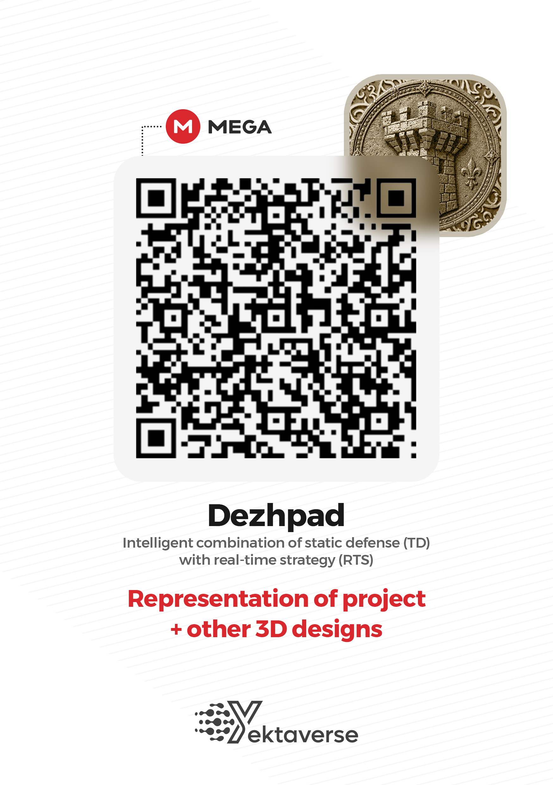
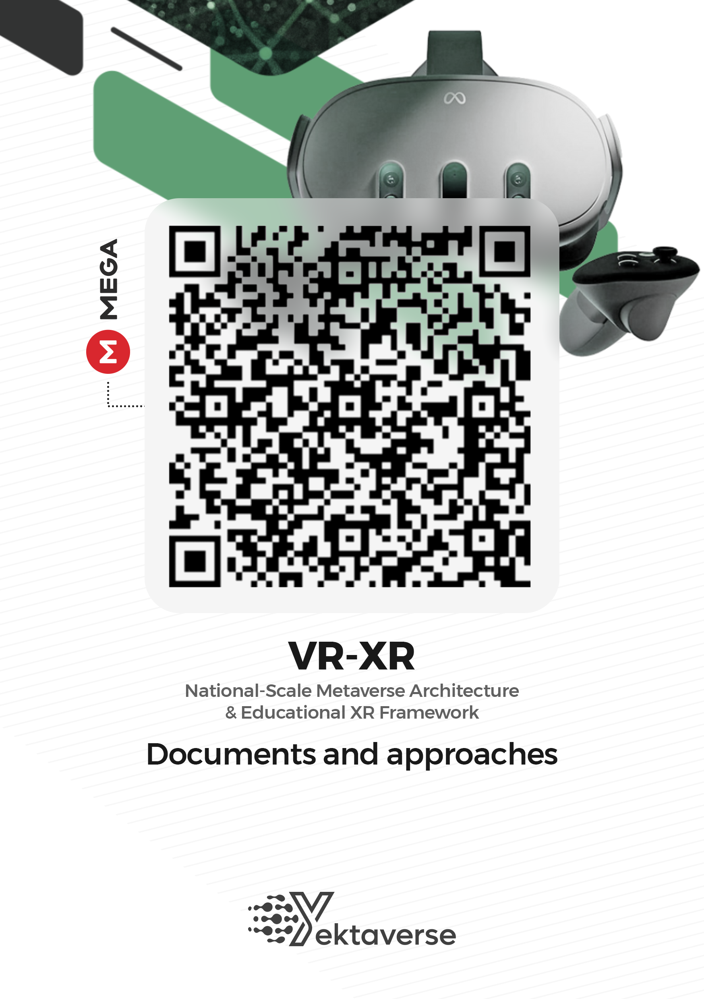
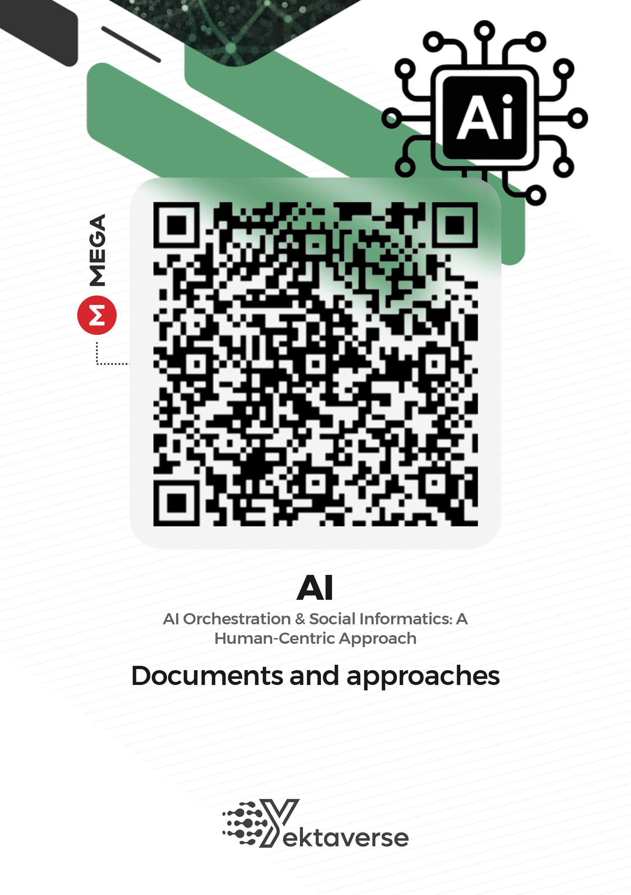
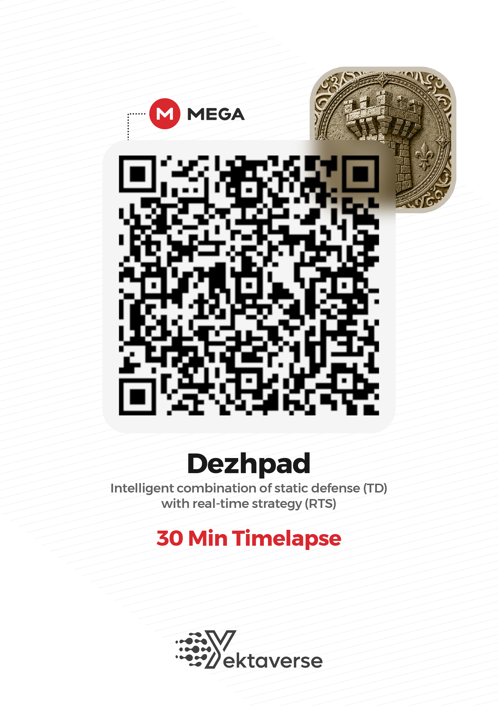
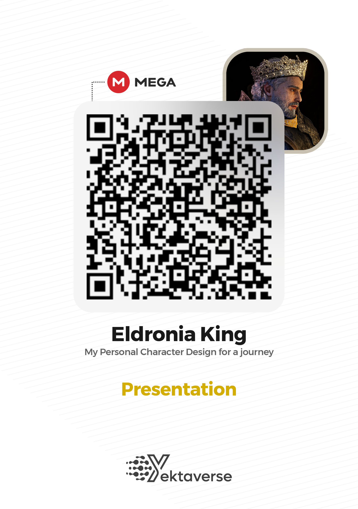
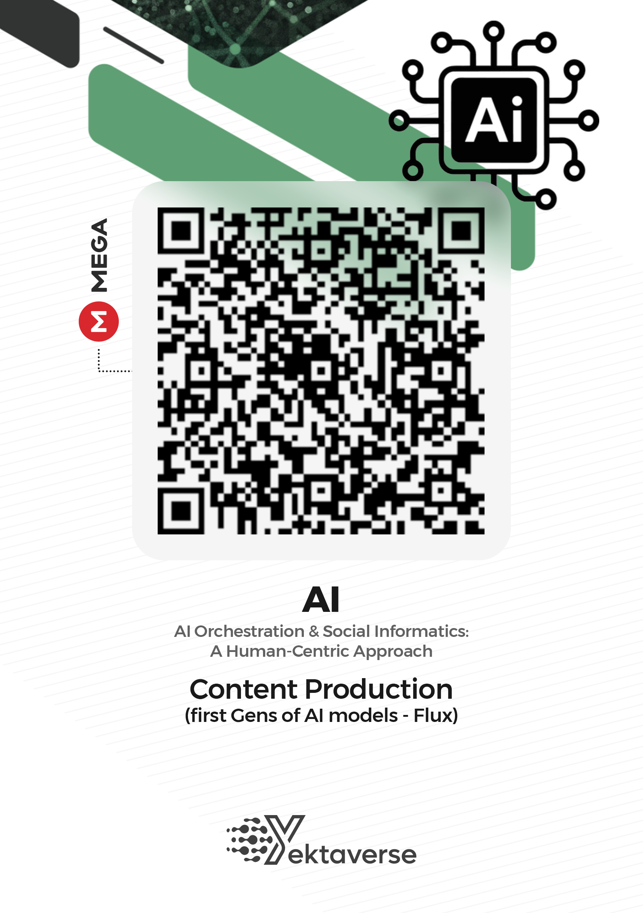
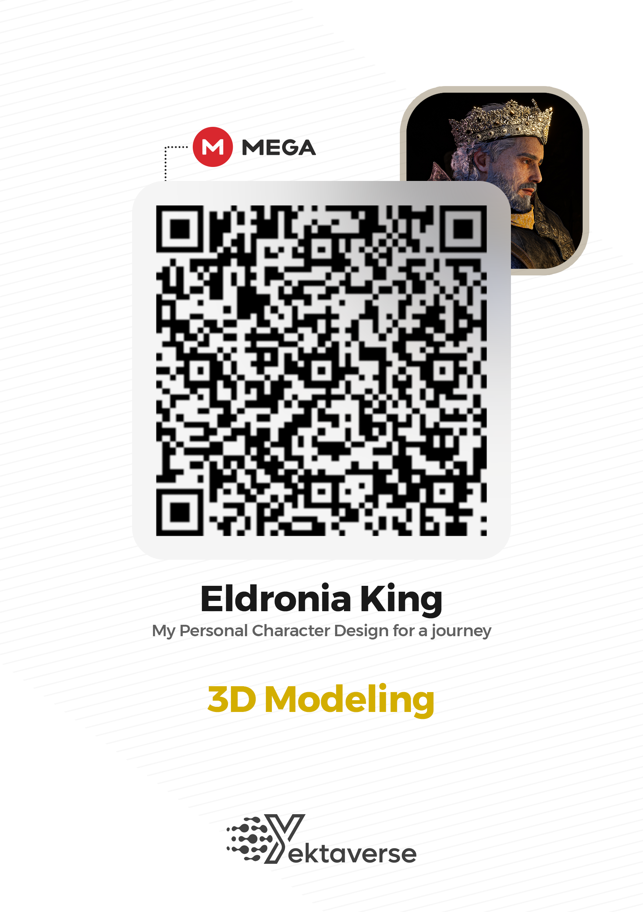
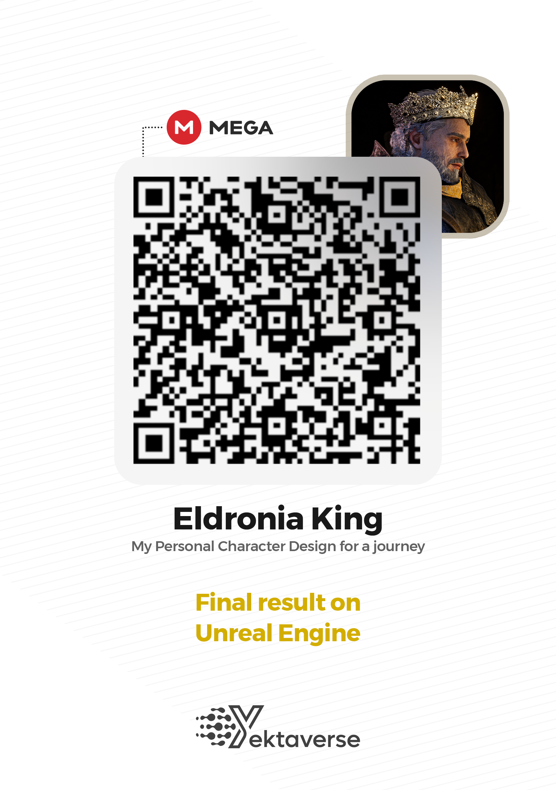

## Hi there 👋

<!--
**AmirYekta1/AmirYekta1** is a ✨ _special_ ✨ repository because its `README.md` (this file) appears on your GitHub profile.

Here are some ideas to get you started:

- 🔭 I’m currently working on ...
- 🌱 I’m currently learning ...
- 👯 I’m looking to collaborate on ...
- 🤔 I’m looking for help with ...
- 💬 Ask me about ...
- 📫 How to reach me: ...
- 😄 Pronouns: ...
- ⚡ Fun fact: ...
-->

### 🔗 Portfolio Quick Access (QR Codes)

| **Game Engineering** | **XR & Medical VR** | **AI & Architecture** |
| :---: | :---: | :---: |
|    *Dezhpad 3D Arts* |    *Clinical VR Framework* |    *AI Multi-Agent System* |
|    *30-min Dev Journey* |    *Clinical Presentation* |    *Generative Pipelines* |
|    *3D Modeling Process* |    *UE5 Implementation* | |
